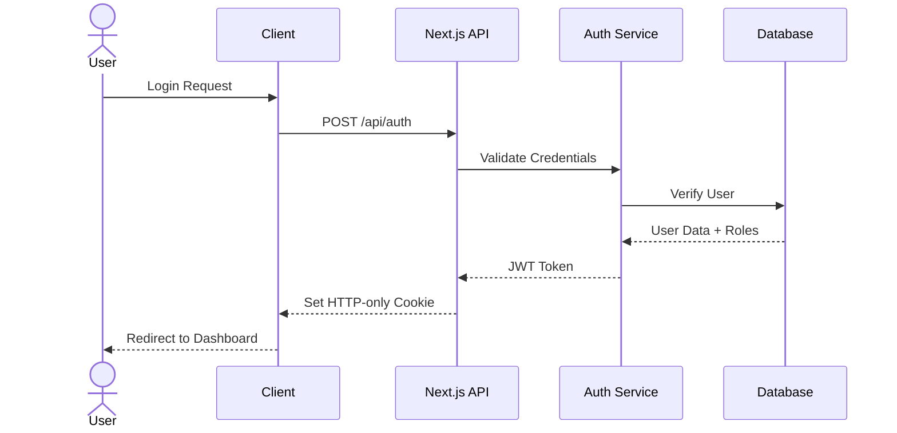
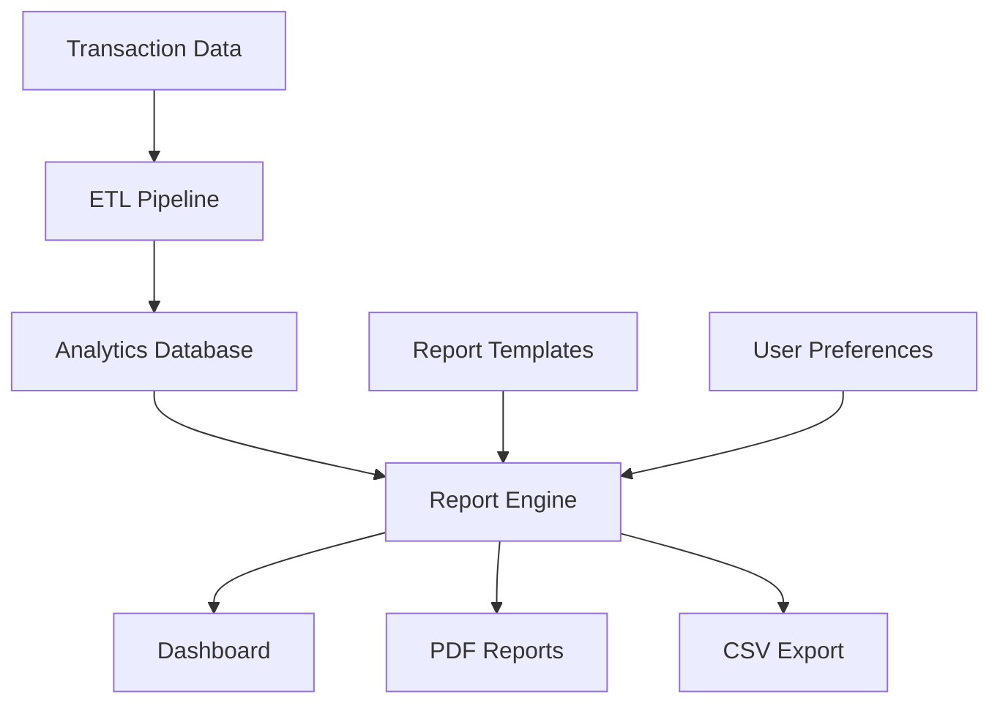
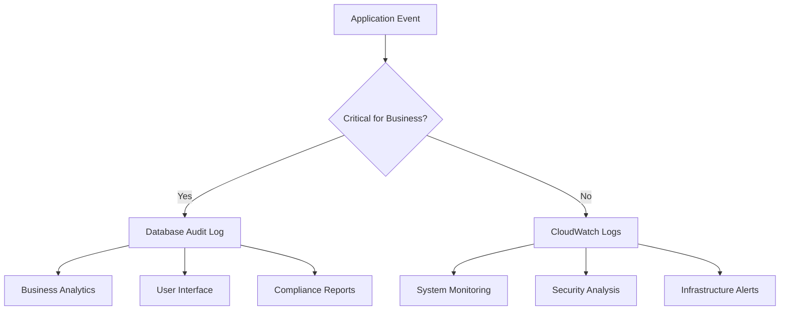
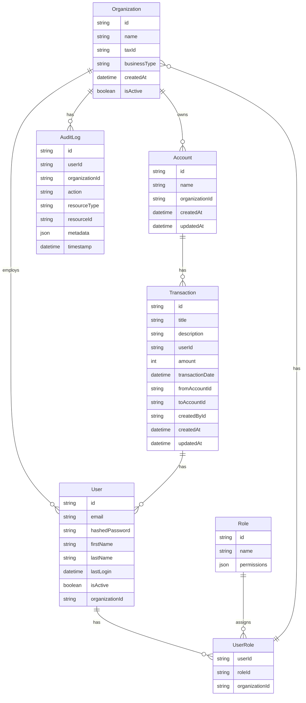

# Next Steps: Heard Financial Transaction App

This document outlines some improvements and extensions to the Financial Transaction App, with a focus on security, scalability, and features relevant to Heard's business context.

## 1. Authentication & Authorization

### Business Need
As a financial platform for therapists, secure access control is critical. We need to:
- Protect sensitive financial data
- Support multiple user roles (therapists, accountants, admins)
- Maintain audit trails for compliance
- Enable secure API access for potential integrations

### Proposed Solution
Implement a multi-tenant authentication system using Next-Auth with role-based access control (RBAC).

#### Multi-Tenant Schema Design
In this context, multi-tenancy means each practice (Organization) can have multiple users (therapists, accountants, admins) who can access and manage their practice's financial data. 

### Implementation Steps
1. Set up Next-Auth with custom providers
2. Implement role-based middleware
3. Create user management API endpoints
4. Add audit logging for all sensitive operations
5. Implement session management
6. Add MFA support for enhanced security

### Security Considerations
- Password hashing using bcrypt
- JWT token rotation
- Rate limiting on auth endpoints
- CSRF protection
- Security headers (HSTS, CSP, etc.)
- Regular security audits

## 2. Advanced Reporting & Analytics

### Business Need
Therapists and practice managers need insights into:
- Revenue trends and forecasting
- Insurance vs direct payment analysis
- Expense categorization
- Tax liability estimation
- Practice profitability metrics

### Proposed Solution
Implement a flexible reporting engine with:
- Customizable dashboards
- Export capabilities
- Scheduled reports
- Data visualization

### Implementation Steps
1. Set up data warehouse for analytics (like AWS Redshift)
2. Create ETL pipeline for transaction data (like Fivetran)
3. Implement report template engine
4. Build dashboard components
5. Add export functionality
6. Implement report scheduling

## 3. Compliance & Audit Features

### Business Need
As a financial platform, compliance with regulations is crucial. We need to:
- Ensure data privacy and security
- Track and report financial transactions
- Maintain audit trails for compliance

### Proposed Solution
Implement a compliance framework with:
- Data privacy policies
- Transaction tracking
- Audit logging
- Reporting capabilities

### Audit Logging Strategy

#### Database Audit Logs
Keep business-critical events.

#### AWS CloudWatch Logs
Configure for system events:
- API access logs
- Lambda function logs
- Network access logs
- Authentication attempts
- System configuration changes

#### Benefits of This Approach
1. **Performance**
   - Only critical business events in database
   - High-volume logs handled by CloudWatch
   - Better database query performance

2. **Cost Effective**
   - CloudWatch for log aggregation and retention
   - Database storage optimized for business needs
   - Automated log rotation and archival

3. **Compliance**
   - Business events directly queryable
   - System events retained in CloudWatch
   - Complete audit trail across systems

4. **Operational**
   - Real-time monitoring via CloudWatch
   - Business analytics via database
   - Simplified backup strategy

### Implementation Steps
1. Set up compliance framework
2. Implement data privacy policies
3. Track and report financial transactions
4. Maintain audit trails for compliance
5. Implement reporting capabilities

## 4. Other Features And Improvements

1. Integration Framework
2. Performance Optimization
  - Caching
  - Load balancing
  - Database optimization
3. Testing Strategy
4. Monitoring & Observability
5. Backup & Recovery
6. CI/CD Pipeline

## 5. Possible Schema Extensions

